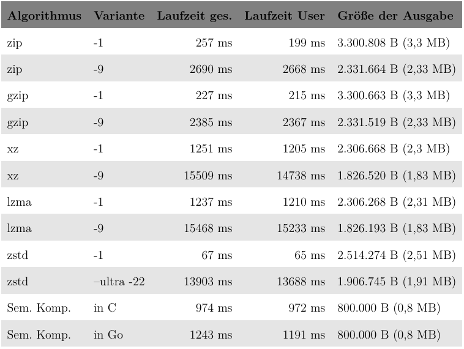

# Blisc - Binary low-bandwith IoT sensor compression

Blisc is a compression library for low-bandwith devices/networks like Microcontrollers in an IoT context, e.g. sensors to send structured time row data. It takes advantage of knowing how the structure of the particular records look like. We called that principle "semantic compression".

Up to now, we support the following implementations of encoder and decoder.

### Encoder

- [C](./encoder/c)
- [Go](./encoder/go)

### Decoder

- [Go](./decoder/go)

## Comparison with general purpose algorithms

### Benchmark setup

**System:**

- Linux Ubuntu server
- 4 Core CPU (2,4 GHz)
- 8 GB RAM

**[Original file](./media/test-data.json)**

- 100.000 randomly generated records
- five Fields per record (two pm values, temperature, humidity, air pressure),
- file size is 12.563 MB

### Benchmark results

## Limitations
### C Implementation
- Only up to 100 fields
- Field names only up to 99 chars

© Marc Auberer 2021-2022
